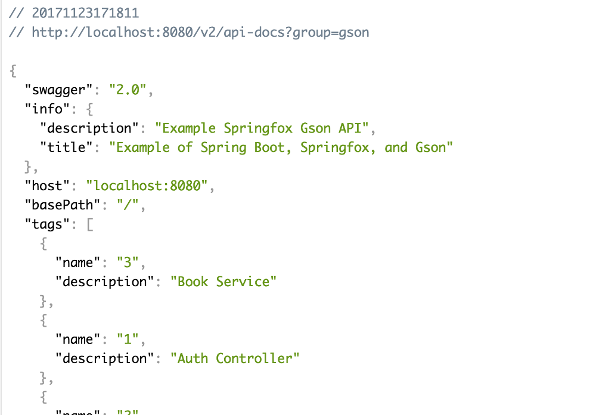

[![Build Status][travis-badge]][travis-badge-url]


Spring Boot with SpringFox and Gson Example
=============================================
This is an example on how to use [SpringFox](http://springfox.github.io/springfox/) 
with [Gson](https://github.com/google/gson). SpringFox doesn't work with Gson
out of the box.

To make Springfox work with Gson, you have to do the following:

#### Include Gson JAR
Include Gson JAR in your Maven pom.

```xml
<dependency>
    <groupId>com.google.code.gson</groupId>
    <artifactId>gson</artifactId>
    <version>2.8.2</version>
</dependency>
```

#### Don't Remove Jackson Databind JAR
You will still need `jackson-databind` JAR. If you are missing the JAR,
your application will make the following complain:

```
org.springframework.beans.factory.BeanCreationException: Error creating bean 
with name 'objectMapperConfigurer' defined in 
springfox.documentation.spring.web.SpringfoxWebMvcConfiguration: 
Post-processing of merged bean definition failed; 
nested exception is java.lang.NoClassDefFoundError: 
com/fasterxml/jackson/databind/ObjectMapper
```

The exception is due to `springfox.documentation.spring.web.ObjectMapperConfigurer`
complaining about missing `com.fasterxml.jackson.databind.ObjectMapper`. 

The `ObjectMapper` exists in `com.fasterxml.jackson.core:jackson-databind:jar`

#### Register JSON Serializers
Register custom serializers for different Springfox artifacts as shown below.
This example includes the custom serializers.

```
Gson gson = GsonBuilder()
    // needed for making calls to /v2/api-docs
    .registerTypeAdapter(Json.class, 
        new SpringfoxJsonSerializer())
    // rest are needed for making calls to /swagger-ui.html
    .registerTypeAdapter(ApiListing.class, 
        new SpringfoxApiListingJsonSerializer())
    .registerTypeAdapter(SwaggerResource.class, 
        new SpringfoxResourceJsonSerializer())
    .registerTypeAdapter(ResourceListing.class, 
        new SpringfoxResourceListingJsonSerializer())
    .registerTypeAdapter(UiConfiguration.class, 
        new SpringfoxUiConfigurationJsonSerializer())
    // needed if you have security
    .registerTypeAdapter(SecurityConfiguration.class, 
        new SpringfoxSecurityConfigurationJsonSerializer())
    ...
    .create();
```

The serializer for `springfox.documentation.spring.web.json.Json` is 
needed for viewing Swagger API JSON docs at '/v2/api-docs'.

Rest of the serializers are needed for viewing Swagger UI at `/swagger-ui.html`

### Build
To build the JAR, execute the following command from the parent directory:

```
mvn clean install
```

### Run
To run the application fromm command line,

```
java -jar target/springfox-gson-example-1.0.0.jar
```

```
 .   ____          _            __ _ _
 /\\ / ___'_ __ _ _(_)_ __  __ _ \ \ \ \
( ( )\___ | '_ | '_| | '_ \/ _` | \ \ \ \
 \\/  ___)| |_)| | | | | || (_| |  ) ) ) )
  '  |____| .__|_| |_|_| |_\__, | / / / /
 =========|_|==============|___/=/_/_/_/
 :: Spring Boot ::        (v1.5.8.RELEASE)

2017-11-23 17:14:35.736  INFO 9896 --- [           main] com.basaki.Application                   : Starting Application on jdoe-78814.local with PID 9896 (/Users/jdoe/springfox-gson-example/target/springfox-gson-example-1.0.0.jar started by indra.basak in /Users/jdoe/springfox-gson-example)
...
2017-11-23 17:14:42.187  INFO 9896 --- [           main] s.d.s.w.s.ApiListingReferenceScanner     : Scanning for api listing references
2017-11-23 17:14:42.455  INFO 9896 --- [           main] s.b.c.e.t.TomcatEmbeddedServletContainer : Tomcat started on port(s): 8080 (http)
2017-11-23 17:14:42.463  INFO 9896 --- [           main] com.basaki.Application                   : Started Application in 7.371 seconds (JVM running for 7.867)
```

### Access Swagger Endpoints

##### Swagger UI
You can view the Swagger UI at `http://localhost:8080/swagger-ui.html`.


##### Swagger JSON
You can view Swagger JSOn doc at `http://localhost:8080/v2/api-docs?group=gson`



[travis-badge]: https://travis-ci.org/indrabasak/springfox-gson-example.svg?branch=master
[travis-badge-url]: https://travis-ci.org/indrabasak/springfox-gson-example/